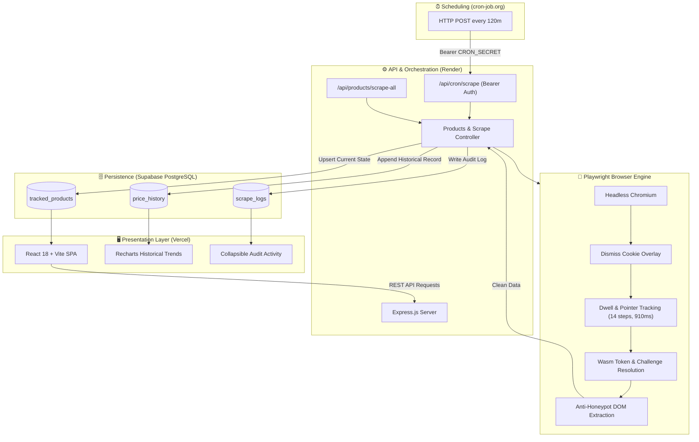

# 🚀 INE Velocity — Autonomous Price & Stock Intelligence Engine ⚡

<p align="center">
  
  
  
  
  
  
</p>

---

## 🌐 Live Deployments & Quick Links

| Component | Platform | Status | URL |
| :--- | :--- | :--- | :--- |
| 🖥️ **Web Dashboard** | **Vercel** |  | [inescraperproject.vercel.app](https://inescraperproject.vercel.app) |
| ⚙️ **Scraper API** | **Render** |  | [scraper-zxhp.onrender.com](https://scraper-zxhp.onrender.com) |
| 🎯 **Target Store** | **INE Mock Store** |  | [demo.inelabteamdev.com](https://demo.inelabteamdev.com) |
| 🗄️ **Database** | **Supabase** |  | [supabase.com](https://supabase.com) |
| 🐙 **Source Code** | **GitHub** |  | [github.com/DownshifterX/Scraper](https://github.com/DownshifterX/Scraper) |

---

## 📖 Executive Overview

**INE Velocity** is a resilient, enterprise-grade automated price tracking and stock monitoring system built to overcome advanced client-side anti-scraping defenses on modern Single-Page Applications (SPAs).

Targeting the challenging **INE Mock Store**, the engine bypasses multi-layered behavioral gating, cryptographic proof-of-work challenges, dynamic obfuscation, honeypot traps, and cookie barriers using **Playwright Chromium browser orchestration**. It pairs with an audit-logged Supabase PostgreSQL storage pipeline, external cron triggers, and an ultra-responsive React dashboard.

---

## 🌟 Key Features

### 🛡️ Advanced Anti-Bot & Honeypot Evasion
- **Behavioral Dwell Emulation**: Satisfies human cursor checks (`minMoves: 8`, `minDwellMs: 600`) with micro-movements and random pauses.
- **Wasm & Session Token Flow**: Authenticates via dynamic cryptographic proof-of-work challenges without triggering 401 unauthorized errors.
- **Honeypot Elimination**: Filters out deceptive zero-opacity, `display: none`, and hidden decoy price tags in the DOM.
- **MRP vs Selling Price**: Segregates strikethrough list prices from effective selling prices.

### 📊 Real-Time Dynamic Dashboard
- **Interactive Metrics**: Track live product counts, average prices, volatility stats, and out-of-stock ratios.
- **Instant "Scrape All" Action**: Trigger batch scrape runs across all tracked products in a single click.
- **Interactive Price Graphs**: Visualize historic pricing trends, drops, and spikes over time.
- **Collapsible Audit Trail**: Detailed real-time logs with response times, attempt counts, and error reports on demand.

### ⏱️ Resilient Pipeline & Automation
- **External Cron Scheduler**: Automated runs every 120 minutes via `cron-job.org` preventing cloud sleep timeouts.
- **Linear Backoff Retries**: Up to 3 attempts with progressive delay (3.5s, 7.0s) for intermittent 503 or 429 errors.
- **Zero Data Corruption Guarantee**: Failed scrapes are logged to audit records but **never** overwrite verified baseline pricing data.
- **In-Memory Fallback Store**: Operates seamlessly in local sandbox mode even without configured database credentials.

---

## 🏗️ System Architecture & Workflow

The entire lifecycle—from catalog discovery to scheduled price scraping—flows across four decoupled layers:



---

## 🔍 Detailed Scraping Workflow

Why simple `curl` or `cheerio` scrapers fail and how **INE Velocity** overcomes every hurdle:

```
Step 1: Navigate to Target URL
 └── Waits up to 25s for Vite hydration (DOM: `<div id="root"></div>`)

Step 2: Dismiss Cookie Banner
 └── Evaluates and removes `.cookie-overlay` intercepting pointer events

Step 3: Human Cursor Simulation (Behavioral Bypass)
 └── Performs 14 discrete cursor movements over `.price-block`
 └── Dwells for 910ms (surpasses target's requirement of 8 moves & 600ms)

Step 4: Interactive Price Gating
 └── Issues trusted click on `button[aria-label="Reveal price"]`
 └── Intercepts WebAssembly challenge & session token generation

Step 5: Anti-Honeypot Extraction
 └── Filters out elements with display:none, visibility:hidden, opacity:0
 └── Separates strikethrough MRP from live selling price (e.g. ₹6,026)
 └── Normalizes stock count ("In stock · 25 left", "Out of Stock")

Step 6: Atomic Database Transactions
 └── Success: Updates tracked_products, appends to price_history & scrape_logs
 └── Failure: Records failure in scrape_logs; preserves existing valid price
```

---

## 🛠️ Technology Stack

| Layer | Technologies |
| :--- | :--- |
| **Frontend** | React 18, TypeScript, Vite, TailwindCSS, Lucide Icons, Recharts |
| **Backend** | Node.js, Express, TypeScript, ts-node |
| **Browser Automation** | Playwright (Chromium Engine) |
| **Database** | PostgreSQL via Supabase, pgdriver, In-Memory DB Fallback |
| **Scheduling** | cron-job.org HTTP Webhooks |
| **Hosting & CI/CD** | Vercel (Frontend), Render (Backend Web Service), GitHub |

---

## 📡 API Reference

### 📦 Product Management
| Method | Endpoint | Description | Auth |
| :--- | :--- | :--- | :--- |
| `GET` | `/api/products/suggest?q=name` | Autocomplete search suggestions from catalog | None |
| `GET` | `/api/products/search?q=&page=&pageSize=` | Paginated search across 1000+ mock store items | None |
| `GET` | `/api/products/tracked` | List all tracked items with latest price & stock | None |
| `POST` | `/api/products/track` | Add a new product URL to tracking list | None |
| `DELETE` | `/api/products/:id` | Stop tracking and remove product | None |

### ⚡ Scraper Operations
| Method | Endpoint | Description | Auth |
| :--- | :--- | :--- | :--- |
| `POST` | `/api/products/:id/scrape` | Trigger an immediate scrape for a single product | None |
| `POST` | `/api/products/scrape-all` | Batch scrape all tracked products sequentially | None |
| `POST` | `/api/cron/scrape` | Scheduled automated scrape for all active products | `Bearer CRON_SECRET` |

### 📈 Historical Analytics & Logs
| Method | Endpoint | Description | Auth |
| :--- | :--- | :--- | :--- |
| `GET` | `/api/products/:id/history` | Chronological price records for charting | None |
| `GET` | `/api/products/:id/logs` | Scrape execution logs (attempts, duration, status) | None |
| `GET` | `/api/health` | Service health status and uptime verification | None |

---

## 🗄️ Database Schema

Created using standard PostgreSQL on Supabase:

```sql
-- 1. Tracked Products (Metadata & Latest State)
CREATE TABLE tracked_products (
  id UUID PRIMARY KEY DEFAULT gen_random_uuid(),
  product_name TEXT NOT NULL,
  product_url TEXT UNIQUE NOT NULL,
  active BOOLEAN DEFAULT true,
  latest_price NUMERIC(10, 2),
  latest_stock TEXT,
  created_at TIMESTAMPTZ DEFAULT now(),
  updated_at TIMESTAMPTZ DEFAULT now()
);

-- 2. Price History (Time-Series Log)
CREATE TABLE price_history (
  id UUID PRIMARY KEY DEFAULT gen_random_uuid(),
  product_id UUID REFERENCES tracked_products(id) ON DELETE CASCADE,
  price NUMERIC(10, 2) NOT NULL,
  stock TEXT,
  scraped_at TIMESTAMPTZ DEFAULT now()
);

-- 3. Scrape Audit Logs (Execution Telemetry)
CREATE TABLE scrape_logs (
  id UUID PRIMARY KEY DEFAULT gen_random_uuid(),
  product_id UUID REFERENCES tracked_products(id) ON DELETE CASCADE,
  started_at TIMESTAMPTZ NOT NULL,
  finished_at TIMESTAMPTZ NOT NULL,
  status TEXT CHECK (status IN ('SUCCESS', 'RETRIED', 'FAILED')),
  attempt INT DEFAULT 1,
  price NUMERIC(10, 2),
  stock TEXT,
  error_message TEXT,
  duration_ms INT,
  created_at TIMESTAMPTZ DEFAULT now()
);
```

---

## 💻 Local Installation & Setup

### Prerequisites
- **Node.js**: v18.0.0 or later
- **npm** or **yarn**
- **Git**

### 1️⃣ Clone the Repository
```bash
git clone https://github.com/DownshifterX/Scraper.git
cd Scraper
```

### 2️⃣ Configure Environment Variables

#### Backend Configuration:
Create `backend/.env`:
```env
PORT=3000
SUPABASE_URL=https://your-project.supabase.co
SUPABASE_SERVICE_ROLE_KEY=your-supabase-service-role-key
CRON_SECRET=your_secure_cron_token_here
```
*(Note: If Supabase keys are omitted, the backend automatically initializes an in-memory SQLite-like mock store for local development.)*

#### Frontend Configuration:
Create `frontend/.env`:
```env
VITE_API_URL=http://localhost:3000
```

### 3️⃣ Backend Setup & Playwright Installation
```bash
cd backend
npm install
npx playwright install chromium
npm run dev
```
The API server runs on `http://localhost:3000`.

### 4️⃣ Frontend Setup
In a separate terminal:
```bash
cd frontend
npm install
npm run dev
```
The UI will launch on `http://localhost:5173`.

---

## 🎮 Headed Demonstration Mode

Want to watch Playwright bypass cookie banners, simulate cursor hovers, and extract prices live on screen? Run the interactive headed script:

```bash
cd backend
npm run scrape:headed
```

A visible Chromium browser window will launch, navigate through the target store, execute cursor dwell routines, and output real-time terminal diagnostics.

---

## 🚀 Deployment Guide

### 🌐 Frontend (Vercel)
1. Import repository on [Vercel Dashboard](https://vercel.com).
2. Set **Root Directory** to `frontend`.
3. Framework Preset: `Vite`.
4. Environment Variables:
   - `VITE_API_URL`: `https://your-render-backend-url.onrender.com`
5. Click **Deploy**.

### ⚙️ Backend (Render)
1. Create a new **Web Service** on [Render](https://render.com).
2. Connect your repository.
3. Configure settings:
   - **Root Directory**: `backend`
   - **Environment**: `Node`
   - **Build Command**: `npx playwright install chromium && tsc -p tsconfig.build.json`
   - **Start Command**: `npx playwright install chromium && node dist/index.js`
4. Add Environment Variables:
   - `PLAYWRIGHT_BROWSERS_PATH`: `/opt/render/.cache/ms-playwright`
   - `SUPABASE_URL`: `<your-supabase-url>`
   - `SUPABASE_SERVICE_ROLE_KEY`: `<your-key>`
   - `CRON_SECRET`: `<your-secret>`
   - `PORT`: `3000`

### ⏰ Cron Trigger Setup (cron-job.org)
1. Register a new job on [cron-job.org](https://cron-job.org).
2. **URL**: `https://your-render-backend-url.onrender.com/api/cron/scrape`
3. **HTTP Method**: `POST`
4. **Schedule**: Every `120` minutes (2 hours).
5. **Headers**:
   - `Authorization`: `Bearer <YOUR_CRON_SECRET>`
   - `Content-Type`: `application/json`

---

## 🛡️ Edge Cases & Resilience Engineering

| Challenge | Solution Strategy |
| :--- | :--- |
| **Upstream 503 & Flaky Delays** | 3-tier exponential backoff (3.5s → 7.0s delay). Failures are recorded without corrupting price records. |
| **Anti-Bot Pointer Tracking** | Algorithmic mouse interpolation executing 14 coordinates over 910ms with natural jitter. |
| **Render Free Tier Idling** | External webhooks (cron-job.org) ping the endpoint, waking the dyno and executing sequential runs. |
| **Rate Limiting (429)** | 2000ms mandatory cool-down between sequential product scrapes during cron sweeps. |
| **Database Connection Blips** | Built-in in-memory fallback layer ensures zero server crashes during external outage periods. |

---

## 📂 Project Structure

```
Scraper/
├── 📁 backend/
│   ├── 📁 src/
│   │   ├── index.ts           # Express server & API endpoints
│   │   ├── scraper.ts         # Playwright Chromium engine & anti-bot bypass
│   │   ├── db.ts              # Supabase PostgreSQL client & memory fallback
│   │   ├── test-scrape.ts     # Headed interactive CLI verification tool
│   │   └── types.ts           # Shared TypeScript interfaces
│   ├── package.json           # Backend dependencies & build scripts
│   ├── tsconfig.json          # Development TypeScript configuration
│   └── tsconfig.build.json    # Production compile configuration
├── 📁 frontend/
│   ├── 📁 src/
│   │   ├── App.tsx            # Main application layout, tabs & state
│   │   ├── main.tsx           # React DOM root entrypoint
│   │   └── index.css          # Custom styling & animations
│   ├── package.json           # Frontend dependencies
│   └── vite.config.ts         # Vite build configuration
├── schema.sql                 # PostgreSQL database schema definitions
├── DESIGN_NOTE.md             # In-depth architectural evaluation & trade-offs
└── README.md                  # System documentation & developer manual
```

---

## 👥 Authors & Academic Context

- **Author**: [@DownshifterX](https://github.com/DownshifterX)
- **Project**: 7th Semester Capstone / Automated Web Intelligence System
- **License**: MIT License

---

<p align="center">
  <b>Built with ❤️ using Playwright, React, Express & Supabase.</b>
</p>
